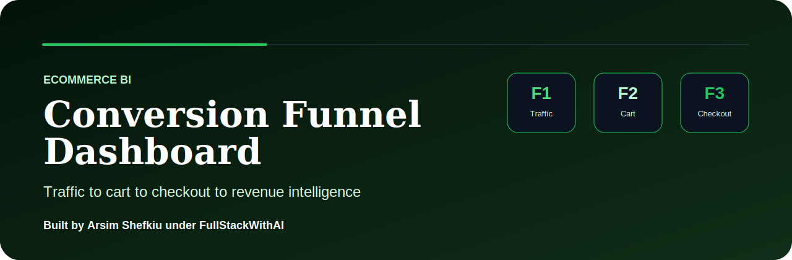

# Ecommerce Conversion Funnel Dashboard

> E-commerce analytics dashboard for funnel conversion, cart abandonment, revenue leakage, product performance, and buyer journey optimization.

Built by **Arsim Shefkiu** under **FullStackWithAI**.

[www.designhubmk.com](https://www.designhubmk.com) · arsim@designhubmk.com · [GitHub: fullstackwithai](https://github.com/fullstackwithai)

---

## Commerce Funnel Theme

> **Traffic to checkout. Cart data to revenue clarity. Funnel leaks to growth opportunities.**

This repository is presented as a premium e-commerce BI dashboard focused on conversion funnels, cart abandonment, checkout performance, product revenue, and buyer journey optimization.

| Theme Layer | Direction |
|---|---|
| **Design Identity** | Green, dark commerce, and revenue-growth accents |
| **Product Feel** | E-commerce growth dashboard / conversion optimization command center |
| **Audience** | Store owners, growth teams, analysts, product managers, BI hiring managers |
| **Core Message** | Traffic + product views + carts + checkout + revenue conversion |

---

## Funnel KPI Layer

| KPI | Purpose |
|---|---|
| **Conversion Rate** | Measures how many visitors become customers |
| **Cart Abandonment** | Identifies revenue leakage |
| **Checkout Completion** | Measures purchase flow performance |
| **Average Order Value** | Tracks revenue quality per order |
| **Top Product** | Highlights best-performing merchandise |

---

## Business Questions

| Question | Why It Matters |
|---|---|
| **Where do customers drop off?** | Helps fix funnel friction |
| **Which products convert best?** | Supports merchandising and promotion strategy |
| **Where is revenue leaking?** | Identifies lost sales opportunities |
| **How can checkout performance improve?** | Supports conversion optimization |

---

## What This Project Demonstrates

| Capability | Evidence in This Repo |
|---|---|
| **E-commerce Analytics** | Funnel, cart, product, and checkout KPIs |
| **Growth BI Thinking** | Dashboard aligned with revenue and conversion decisions |
| **Data Storytelling** | Turns buyer activity into optimization recommendations |
| **Dashboard Strategy** | Funnel-first reporting for store and growth teams |
| **Portfolio Positioning** | Strong DA/BI project for e-commerce, product, and growth roles |

---

## Suggested Project Architecture

```text
ecommerce-conversion-funnel-dashboard/
├── assets/
│   └── readme-hero.svg
├── data/
│   └── ecommerce-funnel-sample.csv
├── sql/
│   └── funnel-analysis.sql
├── dashboard/
│   ├── index.html
│   ├── styles.css
│   └── app.js
├── insights/
│   └── conversion-summary.md
└── README.md
```

---

## Creator & Brand

### Built by **Arsim Shefkiu** under **FullStackWithAI**

> **E-commerce BI theme focused on conversion funnels, cart analytics, checkout performance, and revenue optimization.**

| Creator Focus | Brand Positioning |
|---|---|
| I build commerce dashboards that turn buyer behavior into clearer growth decisions. | **FullStackWithAI** represents premium portfolio work around practical data problems, polished BI presentation, and AI-assisted execution. |

**Theme:** Ecommerce BI · Conversion Funnel · Cart Analytics · Revenue Optimization

[www.designhubmk.com](https://www.designhubmk.com) · arsim@designhubmk.com · [GitHub: fullstackwithai](https://github.com/fullstackwithai)
